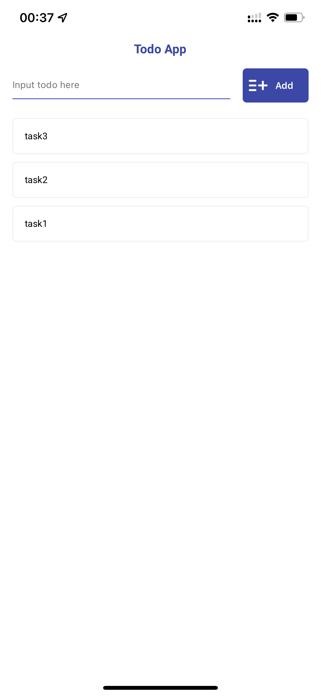
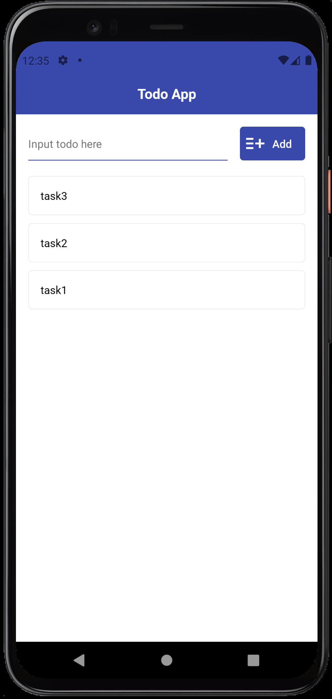
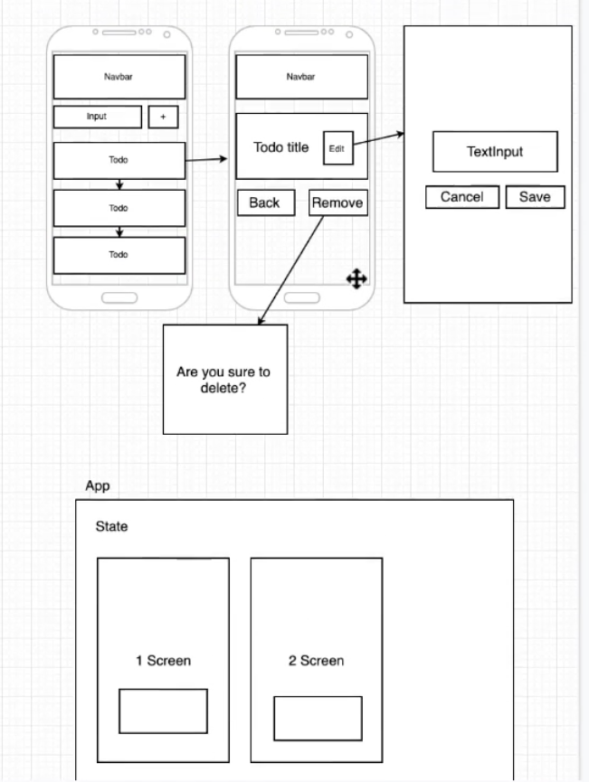
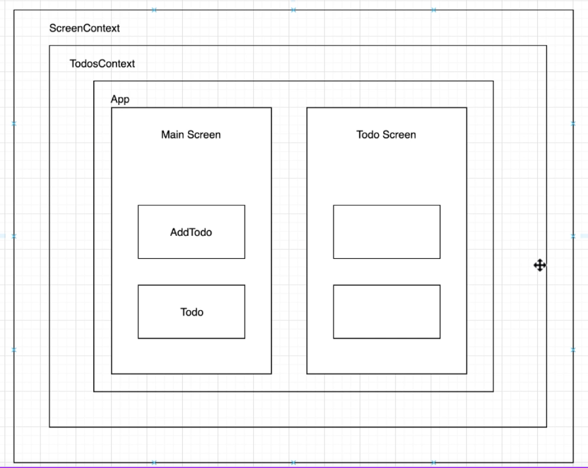

# rn-todo-app

|  |  |

Prototypes:

|  |  |

 

### How to build project

https://github.com/sanioka/rn-common

 

### Notes

⚠️ This course app didn't used React Navigation between screens.  It was made specifically to practice with React useState / useContext: 
`{ todoId ? <TodoScreen/> : <MainScreen/> }`

⚠️ Used Firebase backend 
https://rn-todo-app-1f784-default-rtdb.europe-west1.firebasedatabase.app/todos.json

 

### Course author

@Vladilen Minin 
https://www.udemy.com/course/react-native-complete-guide/

 